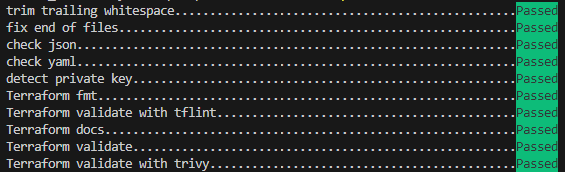
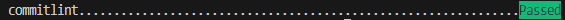

# Client-side Git Hooks using the pre-commit Framework
This is an example repository demonstrating how to implement client-side Git hooks using the [pre-commit framework](https://pre-commit.com/).

## Table of Contents
- [What are Git Hooks](#what-are-git-hooks)
- [What is the pre-commit Framework](#what-is-the-pre-commit-framework)
- [Working with pre-commit](#working-with-pre-commit)
    - [Installing](#installing)
    - [Configuration](#configuration)
    - [Manually Running Hooks](#manually-running-hooks)


## What are Git Hooks
Git hooks are scripts that run automatically every time a particular event occurs in a Git repository. They let you customise Git’s internal behavior and trigger customisable actions at key points in the development life cycle.

There are two groups of these hooks: client-side and server-side. Client-side hooks are triggered by operations such as committing and merging, while server-side hooks run on network operations such as receiving pushed commits.

A few of the common client-side Git hooks are:

* **pre-commit:** The pre-commit script is executed every time you run git commit before Git asks the developer for a commit message or generates a commit object. It’s used to inspect the snapshot that’s about to be committed, to see if you’ve forgotten something, to make sure tests run, or to examine whatever you need to inspect in the code.

* **commit-msg:** The commit-msg hook is called after the user enters a commit message. This is an appropriate place to warn developers that their message doesn't adhere to your team's standards. It will be passed a single filename; this file contains the current contents of the commit message to be validated.

* **pre-push:** The pre-push hook runs during git push, after the remote refs have been updated but before any objects have been transferred.

<br/>

## What is the pre-commit Framework
pre-commit is a framework for managing and maintaining multi-language pre-commit hooks. It simplfies installing and distributing client-side Git hooks between Git repositories.

---
**NOTE**
pre-commit requires [Python 3.0](https://www.python.org/download/releases/3.0/)

---


## Working with pre-commit
### Installing
[Installing](https://pre-commit.com/#install) pre-commit is simple and works cross platform. The framework can be installed and configured with a few simply steps:


Installation is simple and works cross platform. The framework can be installed and configured with a few steps:

1. Install Python 3.0
2. Install the framework:  `pip install pre-commit`
3. Create a `.pre-commit-config.yaml` [configuration file](https://pre-commit.com/index.html#adding-pre-commit-plugins-to-your-project)
4. Run `pre-commit instal` to set up the `pre-commit` git hook scripts

### Configuration
The `.pre-commit-config.yaml` is committed to the repository so on new clones the engineer would just need to install the hooks for all the types required by running `pre-commit install --hook-type [hook]` assuming all other dependencies have been met.

Examples for different Git hooks:

* **pre-commit:** `pre-commit install`
* **commit-msg:** `pre-commit install --hook-type commit-msg`
* **pre-push:** `pre-commit install --hook-type pre-push`

### Manually Running Hooks
Once all files have been commited to Git. the hooks can be invoked against all files by running the following commands:

**pre-commit**
`pre-commit run -a`




**commit-msg**
`pre-commit run --hook-stage commit-msg --commit-msg-filename COMMIT_EDITMSG`



---
**NOTE:**
This will validate the last commited message in the file `.git/COMMIT_EDITMSG`

---

## Structure and Key Folders and Files


| Folder Name | Intent |
| --- | --- |
| `.commitlintrc.yml` | This is the configuration file for from [commitlint](https://commitlint.js.org/) which is run as a `commit-msg` hook   |
| `.pre-commit-config.yaml` | This file configuration for the [pre-commit framework](https://pre-commit.com/) and contains the hooks to run  |
| `tflint.hcl` | This is the configuration file for [tflint](https://github.com/terraform-linters/tflint) which is run as a `pre-commit` hook |
| `deploy/arm` | A combination of files respsonsible for bootstrapping an Azure subscription:<br/>- ARM template<br/>- PowerShell |
| `deploy/terraform/modules` | Terraform shared modules which can be referenced by any root module in the same repository |
| `deploy/terraform/modules/aws/vpc` | An AWS Terraform module which includes a Trivy error `AVD-AWS-0178` |
| `deploy/terraform/sub` | Terraform root modules for infrastructure with a resource scoped of the Azure subscription (sub) |


```
├───deploy
│   ├───arm
│   │   └───sub
│   │       └───bootstrap
│   │           └───template
│   └───terraform
│       ├───modules
│       │   ├───aws
│       │   │   └───vpc
│       │   └───namer
│       └───sub
│           └───core
│               └───infra
│                   └───workspace-variables
└───docs
    └───images
```
